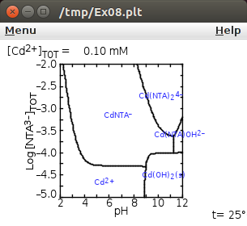
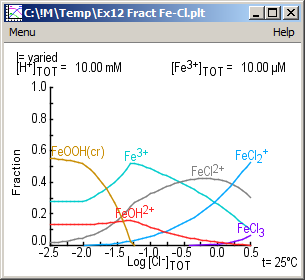
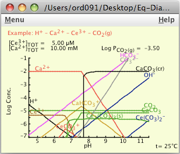

#    Chemical Equilibrium Diagrams (Java)

**Spana** is a program that allows the user to create and view chemical equilibrium diagrams for aqueous systems. The chemical system is defined by the user through the **Database** program, which may be called from **Spana**.

For the course [KD1280][27] (chemical analysis) at [KTH][28] (the Royal Institute of Technology at Stockholm) there is [another version][30] with special settings and a different database. Here you will find the original software (without KTH settings).

A previous version for Windows (now un-maintained, written in Visual Basic) named (**Medusa/Hydra**) and developped at [KTH][1] is available at https://sites.google.com/site/chemdiagr

See also: https://sites.google.com/site/chemdiagr/

## Download
All downloads are available in the [releases section][2]. There are two variants of Chemical Equilibrium Diagrams: multi platform, and Windows. These versions are either a complete zip file or a Windows installer.

- The multi-platform zip-file contains jar-files which may be used under Ubuntu (Linux), Windows or MacOS.

- The Windows setup program contains Windows "exe" files (Java launchers). No administrator rights are needed to install the software. Install either on a computer or as portable software on a USB memory stick.

## Features
* Completely portable - runs off a USB or hard drive.
* Does not require administrator privileges.
* Diagrams may be copied and pasted, printed or exported to image files in formats such as PostScript, PDF, JPG, PNG, etc.
* Example chemical equilibrium diagrams that may be produced with this software:

  

## Get going

[Make your 1st diagram with SPANA and DATABASE][3] (PDF-file).

## System Requirements

* Java 1.7 or later.
* Apple computers: Java 7 requires an Intel-based Mac running Mac OS X 10.7.3 (Lion) or later with a 64-bit browser (Safari, for example).
* [PortableApps.com platform][4] (optional in Windows systems).

## License

* This software is released under [GPLv3 license][5].

## Report problems

See also Ignasi's page on [water chemistry][40].

## Credits

The motor behind **Spana**, performing the chemical equilibrium calculations, is **HALTAFALL** published in:

- Ingri N, Kakolowicz W, Sillén L G, Warnqvist B, 1967. High-speed computers as a supplement to graphical methods - V. HALTAFALL, a general program for calculating the composition of equilibrium mixtures. [Talanta, 14: 1261-1286][10]. _Errata:_ [Talanta, 15(3) (1968) xi-xii][11].

- Warnqvist, B., Ingri, N., 1971. The HALTAFALL program - some corrections, and comments on recent experience. [Talanta 18, 457–458][12].

Many ideas for the plotting of chemical diagrams are from the **SOLGASWATER** code by [Gunnar Eriksson][13], at Umeå uiversity by that time. SOLGASWATER's publication:

* Eriksson G, 1979. An algorithm for the computation of aqueous multicomponent, multiphase equilibria. [Anal. Chim. Acta, 112: 375-383][14].

**DataBase** (formerly HYDRA) is inspired on a
program & database (initially for MS-DOS) created by Mingsheng Wang, Andrey Zagorodny under the leadership of Mamoun Muhammed at Materials Chemistry, Royal Institute of Technology (KTH), Stockholm.

Several code parts and programming suggestions are from Réal Gagnon's site [Real's HowTo][20]. The external browser launcher is [BareBones][21]. The Java "vector cut-and-paste" class [jvectClipboard][22] is by Serge Rosmorduc, see [JSesh][23]. ClassLocator, ClipboardCopy, CSVparser,  ExternalLinkContentViewerUI, PrintUtility and SortedListModel are adapted from ideas and code found in the internet at diverse sites (many not existing anymore). This software has been developped using the [portable][24] version of [Netbeans][25].

The following persons have contributed with ideas and suggestions: Gunnar Eriksson (Umeå), Ingmar Grenthe (KTH),
Johan Blixt (KTH), Sven-Olof Pettersson (Studsvik) and
Joachim Zeising (KTH). Many thanks are due to the chemistry teaching staff at KTH: Joan Lind, Gabor Merenyi, Olle Wahlberg, Tom Wallin, Mats Jansson, Märtha Åberg, and many others. And many thanks to all students at KTH who helped me in shaping up the software and in finding many bugs!

## Last Updates
- 2020-June - Improvements to avoid "too many iterations" problems. Revision of the help files. Modifications to write and read all text files in Unicode UTF-8 format. Modifications to allow calculation of activity coefficients up to 1000°C.
- 2020-Feb - Corrected an error that made Spana to fail performing the calculations in Linux-Ubuntu.
- 2019-Feb - Restored text database format to old format, if possible. Introduced special settings and a special [database][26] for the course on chemical analysis [KD1280][27] at the Royal Institute of Technology (KTH).
- 2018-Oct - New database formats, including both a power series expression and a look-up table, allow the search and data selection at higher temperatures (up to 600 C) and pressures (up to 5k bar). Chemical equilibrium diagrams may be made for supercritical aqueous. solutions. **To do:** update the help file to document these changes.
- 2018-Aug - Increased the speed of the calculations. For Windows: improved the java-launchers (exe-files). For MacOS created a script that the user may use to create "apps".
- 2018-July - Added the possibility to extract data at temperatures above 100°C (by manually changing the ini-file for Database). Added case-insensitive search of reference keys.
- 2018-April - Improvements in activity coefficients. Improvement in solid phase selection.
- 2018-March - Removed an error when merging two data-files with solid components. Lowered tolerance when HaltaFall returns "too many iterations"
- 2017-May - Added changing tolerance when calculating diagrams
- 2017-Jan - Corrected an error in data-file merging. Added "(a)" and "(ppt)" as types of solid phases
- 2016-Jan - Revision to speed up the method to select which solid phases precipitate.

 [1]: https://www.kth.se/che/medusa/
 [2]: https://github.com/ignasi-p/eq-diagr/releases/latest
 [3]: https://github.com/ignasi-p/eq-diagr/blob/master/Make_1st_diagram.pdf
 [4]: http://portableapps.com
 [5]: https://sv.wikipedia.org/wiki/GNU_General_Public_License

[10]: https://doi.org/10.1016/0039-9140(67)80203-0
[11]: https://doi.org/10.1016/0039-9140(68)80071-2
[12]: https://doi.org/10.1016/0039-9140(71)80069-3
[13]: https://www.hanser-elibrary.com/doi/pdf/10.3139/146.070904
[14]: https://doi.org/10.1016/S0003-2670(01)85035-2

[20]: http://www.rgagnon.com/howto.html
[21]: http://centerkey.com/java/browser
[22]: http://comp.qenherkhopeshef.org/jvectCutAndPaste
[23]: https://sourceforge.net/projects/jsesh/
[24]: https://github.com/garethflowers/netbeans-portable
[25]: https://netbeans.org/
[26]: https://github.com/ignasi-p/eq-diagr-kth/releases/latest
[27]: https://www.kth.se/student/kurser/kurs/KD1280
[28]: https://www.kth.se/che
[29]: https://github.com/ignasi-p/eq-diagr
[30]: https://github.com/ignasi-p/eq-diagr-kth

[40]: https://sites.google.com/view/groundwatergeochemistry
